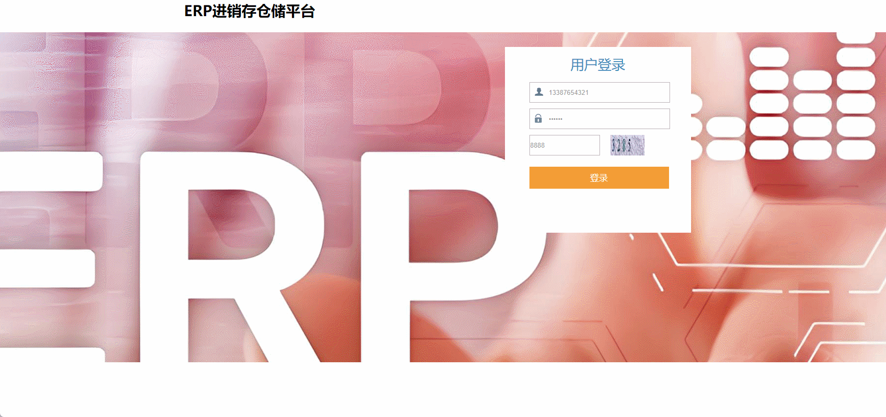

# enterprise-resource-planning🎂

基于SpringBoot+Thymeleaf的ERP进销存仓储平台

## 介绍🌞

> 系统实现了很多模块功能：包含用户的新增、删除、修改与查询；采购入库管理的订单生成、跟踪与库存更新；订单处理的自动化审核、物流分配；物料信息的实时监控与分析；供应商数据的管理与评估。这样一来，企业能够一站式地处理各类仓储事务，从而优化运营效率

## 项目演示🌞

> 管理员


> 普通用户



## 安装教程🌞

```
1. 运行环境准备mysql8 + java8

2. 配置maven路径，加载依赖

3. 运行sql文件，确保application.yml或config.properties的数据库名称和账号密码是数据库所在主机的账号密码
```

## 使用说明🌞

```
1. 登入

    管理员账号：admin 密码：123456

    普通账号：13387654321 密码：123456
  
2. 运行流程

SpringBoot+Vue项目的部署详情可以查看这篇CSDN博客：http://t.csdnimg.cn/kpuxS

前后端不分离项目的部署流程可以查看这篇CSDN博客：http://t.csdnimg.cn/CslA5
```


## CSDN项目合集🌞

点击前往：http://t.csdnimg.cn/Q4u84


## 联系我🌞

**有偿获取完整源码或调试代码**

🐧：1902317191

微信：


